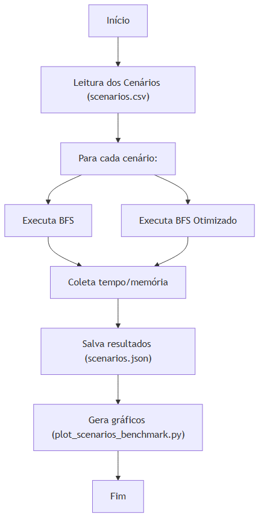

# Missionários e Canibais — Relatório e Fluxo do Código

## 🧩 Introdução

O problema dos Missionários e Canibais é um clássico da lógica e IA: transportar missionários e canibais de uma margem do rio para outra, sem nunca deixar missionários em menor número que canibais em qualquer margem.

## 🚦 Modelagem e Cenários

- **Estados**: (M, C, B) — missionários, canibais na esquerda, posição do barco.
- **Ações**: mover até Z pessoas (barco) respeitando as regras de segurança.
- **Cenários**: lidos de `scenarios.csv`, variando quantidades e capacidade do barco.

## ⚙️ Fluxo do Código

1. **Leitura dos Cenários**: O script lê todos os cenários do arquivo CSV.
2. **Execução dos Algoritmos**: Para cada cenário, executa BFS normal e BFS otimizado.
3. **Benchmark**: Mede tempo e memória de cada abordagem, com rodadas alternadas para justiça estatística.
4. **Armazenamento**: Resultados salvos em `scenarios.json`.
5. **Visualização**: O script `plot_scenarios_benchmark.py` gera gráficos interativos dos resultados.

## 📊 Diagrama do Fluxo

## ▶️ Como Usar

1. Edite/adicione cenários em `scenarios.csv` (formato: missionarios,canibais,cap_barco).
2. Execute `run_benchmarks.py` para gerar resultados.
3. Execute `plot_scenarios_benchmark.py` para visualizar os gráficos.

---

> Para detalhes matemáticos e explicações, veja o restante deste README.

---

🧠 O Problema dos Missionários e Canibais
O problema dos Missionários e Canibais é um clássico puzzle de lógica frequentemente utilizado na Ciência da Computação para introduzir conceitos de Inteligência Artificial e algoritmos de busca.

A Premissa:
Três entidades principais compõem o cenário: Missionários (X), Canibais (Y) e um Barco com capacidade máxima de Z pessoas. Inicialmente, todos estão na margem esquerda de um rio. O objetivo é transportar todos, em segurança, para a margem direita.

A Restrição Fundamental (Regra de Sobrevivência):
Em nenhum momento, e em nenhuma das margens (ou dentro do barco), o número de canibais pode ser maior do que o número de missionários. Se isso acontecer, os missionários serão devorados e o jogo termina. (Nota: Uma margem com 0 missionários e vários canibais é considerada segura).

🔍 Modelagem como Busca em Espaço de Estados
Para que um computador consiga resolver este problema de forma autônoma, precisamos traduzir a narrativa acima para um modelo matemático chamado Espaço de Estados. Isso transforma o problema em um "grafo" virtual, onde cada nó é uma situação possível do jogo, e cada aresta é uma viagem de barco.

Para modelar o problema, definimos 5 componentes principais:

1. Representação do Estado
Um estado deve conter todas as informações necessárias para descrever o cenário atual em um dado momento. Como o número total de pessoas é fixo, basta rastrear quem está na margem de origem (Esquerda). Podemos representar o estado como uma tupla de três valores: (M, C, B)

M: Número de missionários na margem esquerda.

C: Número de canibais na margem esquerda.

B: Posição do barco (1 para Esquerda, 0 para Direita).

(A margem direita é deduzida implicitamente: Missionários na direita = X - M, Canibais na direita = Y - C).

1. Estado Inicial
É o ponto de partida do nosso algoritmo, onde todos estão na margem esquerda.

Representação: (X, Y, 1)

1. Estado Objetivo (Meta)
É a condição de parada. O objetivo é alcançado quando todos estão na margem direita, ou seja, a margem esquerda está vazia.

Representação: (0, 0, 0)

1. Ações e Transições
As ações definem como podemos mudar de um estado para outro. Neste problema, a ação é "mover m missionários e c canibais no barco".

Regra de Transição: Se o barco está na esquerda, subtraímos (m, c) do estado atual. Se o barco está na direita, adicionamos (m, c) ao estado atual.

Restrição de Capacidade: A soma das pessoas no barco deve ser maior que 0 e menor ou igual à capacidade do barco: 1 <= (m + c) <= Z.

1. Validação de Estados (Função de Custo/Poda)
O algoritmo gerará muitas combinações, mas nem todas são permitidas. Antes de aceitar um novo estado (nó) na nossa árvore de busca, aplicamos as seguintes regras para garantir que é um estado válido:

Não pode haver números negativos de pessoas.

O número de pessoas não pode exceder o total original.

Segurança na Esquerda: Se M > 0, então M >= C.

Segurança na Direita: Se (X - M) > 0, então (X - M) >= (Y - C).

🚀 Por que essa modelagem é poderosa?
Ao encapsular o problema neste formato matemático, podemos aplicar algoritmos de busca genéricos (como BFS - Busca em Largura, DFS - Busca em Profundidade, Dijkstra ou A*). O algoritmo simplesmente explora as transições válidas de estado em estado, construindo uma árvore de possibilidades até que um dos ramos atinja o Estado Objetivo, revelando assim o caminho exato (passo a passo) para a vitória.
